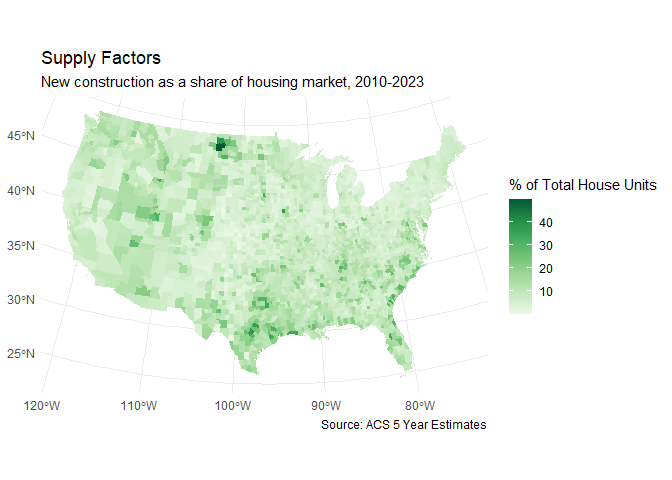
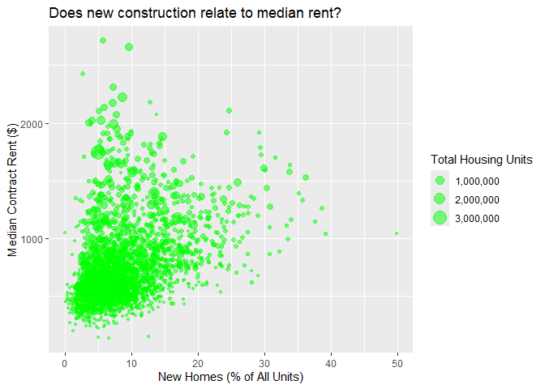

Interpreting Social Patterns with Census Data
================
John Lauermann, School of Information, Pratt Institute
Last updated: November 2025

# Overview

Census data products are the primary historic record of American
society, available as open data for every community in the United
States. The long temporal record and diverse geographic scope of these
data present opportunities for data storytelling at scale. Census data
allow you to tell stories that move beyond small scale case studies, to
think about national patterns and historic trends.

In this workshop, you’ll learn how to visualize and analyze Census data
in ways that could support data storytelling. The script that follows
proceeds in three parts:

1.  Explore and query Census data from the Census API using `tidycensus`

2.  Visualize data patterns using `ggplot2` and a data visualization
    approach called the “[grammar of
    graphics](https://www.tandfonline.com/doi/abs/10.1198/jcgs.2009.07098)”

3.  Statistically test data patterns using R tools for correlation and
    simple linear regression.

#### Data storytelling context

In the workflow that follows, I’ll the topic of housing affordability.
My primary variable of interest is median rent – a key metric for
assessing the scope of the housing crisis in American cities. There are
two broad schools of thought around why housing is so unaffordable. In
this example I’d like to do some data storytelling around these
potential story lines.

- One approach focuses on a lack of [housing
  supply](https://www.urban.org/projects/road-map-address-americas-housing-crisis).
  The supply-side approach is common in the [YIMBY
  movement](https://onlinelibrary.wiley.com/doi/abs/10.1111/1468-2427.13062)
  and the ‘[abundance
  agenda](https://www.simonandschuster.com/books/Abundance/Ezra-Klein/9781668023488)’,
  political movements that argue for deregulating housing development
  through reforms to zoning and building codes. I’ll measure that by
  assessing new home construction.

- Another approach focuses on [housing
  demand](https://journals.sagepub.com/doi/abs/10.1177/0042098020940596).
  The demand-side argument is common among academic researchers and
  activist groups that highlight the [uniquely
  sticky](https://www.nber.org/papers/w22816) nature of housing markets,
  and [market
  failures](https://www.jchs.harvard.edu/press-releases/new-report-highlights-unease-housing-market-amid-worsening-affordability-crisis)
  like a tendency for developers to focus on luxury real estate when
  most demand is actually for affordable housing. I’ll measure this by
  assessing newcomers within neighborhoods.

These factors are not mutually exclusive: the truth is likely that we
need policy solutions focused on **both** supply and demand factors. The
goal below is to present a more nuanced picture of the debate, by
assessing patterns at scale and using statistical tests to think beyond
simply visualizing patterns.

#### Getting started

Download this file from GitHub and then open it in R Studio
(`File>Open File`). Choose the Visual view if it doesn’t automatically
populate.

To run the code, either click the small green “Run Current Chunk” button
in the top right of each code chunk, or put your cursor anywhere in the
chunk then hit `Cntrl + Shift + Enter` (for a PC) or
`Cmd + Shift + Enter` (for a Mac).

We’ll start by loading the necessary packages for this workflow. In R, a
package is a collection of tools that are used for specific kinds of
workflows. The packages are all open source, and you can synthesize as
needed within your own code.

``` r
# verify whether you need these packages, and install if so
if (!require(dplyr)) install.packages("dplyr", dependencies = TRUE)
```

    ## Loading required package: dplyr

    ## 
    ## Attaching package: 'dplyr'

    ## The following objects are masked from 'package:stats':
    ## 
    ##     filter, lag

    ## The following objects are masked from 'package:base':
    ## 
    ##     intersect, setdiff, setequal, union

``` r
if (!require(ggplot2)) install.packages("ggplot2", dependencies = TRUE)
```

    ## Loading required package: ggplot2

    ## Warning: package 'ggplot2' was built under R version 4.4.3

``` r
if (!require(stringr)) install.packages("stringr", dependencies = TRUE)
```

    ## Loading required package: stringr

``` r
if (!require(tidycensus)) install.packages("tidycensus", dependencies = TRUE)
```

    ## Loading required package: tidycensus

    ## Warning: package 'tidycensus' was built under R version 4.4.3

``` r
if (!require(tmap)) install.packages("tmap", dependencies = TRUE)
```

    ## Loading required package: tmap

    ## Warning: package 'tmap' was built under R version 4.4.3

``` r
# now load the libraries
library(dplyr)      # for managing data tables
library(ggplot2)    # for data visualization
library(stringr)    # for filtering string columns
library(tidycensus) # for using the Census API
library(tmap)       # for custom mapping
```

# Task 1: Explore and query Census data

The US Census Bureau publishes much of its data via the [Census Data
API](https://www.census.gov/data/developers/guidance/api-user-guide.html).
If you already know what you’re looking for, the API is often a more
efficient way to query data than by navigating and downloading from the
general [Census website](https://data.census.gov/). That said, you
*really* have to understand the structure of Census data in order to use
the API. So in this section we’ll briefly recap Census products,
geographies, and structure of content. Potentially useful ways to
explore Census data include:

- The Census data website, which has an interactive query function:
  <https://data.census.gov/>

- The Census API Discovery Tool, which explains the API structure:
  <https://api.census.gov/data.html>

We’ll start by setting up an API call. To get started, you need to
obtain a free [Census API
key](https://api.census.gov/data/key_signup.html). Save this somewhere
secure, and remember not to share it on public platforms (e.g. when you
share your code on a portfolio…).

    ## To install your API key for use in future sessions, run this function with `install = TRUE`.

#### **Data products**

Most of the time, we are interested in the demographic, socioeconomic,
housing, and employment data from the Decennial Census and American
Community Survey.

The [Decennial
Census](https://www.census.gov/programs-surveys/decennial-census.html)
has been conducted every decade since 1790. It is the longest and most
comprehensive record of American society, covering thousands of
variables. Like any *census*, it is intended to be a comprehensive count
of every person living in the country (though there are well-known
issues around enumerating some [“hard-to-count
populations”](https://www.census.gov/newsroom/blogs/random-samplings/2023/10/understanding-undercounted-populations.html)).

The [American Community Survey
(ACS)](https://www.census.gov/programs-surveys/acs.html) is a companion
to the Decennial Census, run every year since 2005. It includes many of
the same variables counted in the Census, available on a more regularly
updated basis. But like any *survey*, the ACS counts only a small sample
of the overall population (typically about 3.5 million households
annually, out of ~127 million households nationally). For this reason
ACS data are always published in two forms, an *estimate* of the data
value and a *margin of error* describing uncertainty about that data
value. Furthermore, ACS data are aggregated into different temporal
estimates:

- *ACS 1 year estimates* use data from only the year in question. They
  are only available for some variables and at course geographic scales.

- *ACS 3 year estimates* use data from the year in question plus the
  preceding two years (e.g. a 2021-2023 ACS 3 year estimate is an
  estimate of 2023 values, based on an average of data from 2021 through
  2023). They are available for most variables and some finer geographic
  scales.

- *ACS 5 year estimates* use data from the year in question plus the
  preceding four years (e.g. a 2019-2023 ACS 3 year estimate is an
  estimate of 2023 values, based on an average of data from 2019 through
  2023). They are available for nearly all variables at nearly all
  geographic scales.

For this exercise, we’ll work with data from the ACS 5 year estimates,
for the most recent year available. To do that, we’ll first pull up a
list of all the variables in that data product. Here is a [list of
options](https://walker-data.com/tidycensus/articles/basic-usage.html#searching-for-variables)
for defining the parameters on that `load_variables()` function.

``` r
# query metadata from the api, naming the year and data product
# parameter options available at https://walker-data.com/tidycensus/articles/basic-usage.html#searching-for-variables 
variablelist <- load_variables(year= 2023, dataset = "acs5")
```

You now have a data frame called `variablelist` under the Environment
tab on the top right of your screen. You can click on it to open and see
the structure of what we downloaded. This will list each census variable
code, a variable name, and information on the sampling structure and
finest scale at which data are available.

#### Querying the API

Once you know the identifier codes for the variable(s) you want, we can
configure an API call. Remember that Census/ACS data come packaged in
numerous geographic scales, each identified with nesting FIPS codes.

- *States*: There are 50 of them, covering the entire US.

- *Counties*: There are 3007 of them, nested within states.

- *Tracts*: Each tract is a statistical area home to somewhere between
  2500-8000 residents. They describe what the census considers to be a
  relatively meaningful population area based on demographic, economic,
  and housing characteristics. Their geographic size is inversely
  proportional to their population density, so they will be small in
  cities and larger in rural areas. They are nested within counties,
  which are nested within states.

- *Block groups*: Each block group is a subdivision of a tract, home to
  between 600-3000 people. This is generally the finest scale of
  aggregation available for ACS data due to survey limitations and data
  privacy concerns.

Here is a list of [geography
options](https://walker-data.com/tidycensus/articles/basic-usage.html#geography-in-tidycensus)
for the `tidycensus` library. See also the Census [*Geographic Areas
Reference Manual*](https://www2.census.gov/geo/pdfs/reference/GARM/) for
all the technical details.

``` r
# define a list of variables, including more intuitive names
variables <- c(MedianConRent = "B25058_001",
               HouseUnits_sum = "B25002_001",
               HouseUnits_built2020orlater = "B25034_002",
               OccupiedHouseUnits_sum = "B25038_001",
               Owner_MovedIn_after2021 = "B25038_003",
               Renter_MovedIn_after2021 = "B25038_010"
               )
```

``` r
# set up an API query
data <- get_acs(geography = "county",    # all counties in the US
                variables = variables,   # all variables defined in the list above
                output = "wide",         # row = observation, column = variable
                year = 2023,             # most recent year
                geometry = TRUE         # include spatial boundary data   
                )             
```

    ## Getting data from the 2019-2023 5-year ACS

    ## Downloading feature geometry from the Census website.  To cache shapefiles for use in future sessions, set `options(tigris_use_cache = TRUE)`.

    ##   |                                                                              |                                                                      |   0%  |                                                                              |                                                                      |   1%  |                                                                              |=                                                                     |   1%  |                                                                              |=                                                                     |   2%  |                                                                              |==                                                                    |   2%  |                                                                              |==                                                                    |   3%  |                                                                              |==                                                                    |   4%  |                                                                              |===                                                                   |   4%  |                                                                              |===                                                                   |   5%  |                                                                              |====                                                                  |   5%  |                                                                              |====                                                                  |   6%  |                                                                              |=====                                                                 |   6%  |                                                                              |=====                                                                 |   7%  |                                                                              |=====                                                                 |   8%  |                                                                              |======                                                                |   8%  |                                                                              |======                                                                |   9%  |                                                                              |=======                                                               |   9%  |                                                                              |=======                                                               |  10%  |                                                                              |=======                                                               |  11%  |                                                                              |========                                                              |  11%  |                                                                              |========                                                              |  12%  |                                                                              |=========                                                             |  12%  |                                                                              |=========                                                             |  13%  |                                                                              |=========                                                             |  14%  |                                                                              |==========                                                            |  14%  |                                                                              |==========                                                            |  15%  |                                                                              |===========                                                           |  15%  |                                                                              |===========                                                           |  16%  |                                                                              |============                                                          |  16%  |                                                                              |============                                                          |  17%  |                                                                              |============                                                          |  18%  |                                                                              |=============                                                         |  18%  |                                                                              |=============                                                         |  19%  |                                                                              |==============                                                        |  19%  |                                                                              |==============                                                        |  20%  |                                                                              |==============                                                        |  21%  |                                                                              |===============                                                       |  21%  |                                                                              |===============                                                       |  22%  |                                                                              |================                                                      |  22%  |                                                                              |================                                                      |  23%  |                                                                              |================                                                      |  24%  |                                                                              |=================                                                     |  24%  |                                                                              |=================                                                     |  25%  |                                                                              |==================                                                    |  25%  |                                                                              |==================                                                    |  26%  |                                                                              |===================                                                   |  26%  |                                                                              |===================                                                   |  27%  |                                                                              |===================                                                   |  28%  |                                                                              |====================                                                  |  28%  |                                                                              |====================                                                  |  29%  |                                                                              |=====================                                                 |  29%  |                                                                              |=====================                                                 |  30%  |                                                                              |=====================                                                 |  31%  |                                                                              |======================                                                |  31%  |                                                                              |======================                                                |  32%  |                                                                              |=======================                                               |  32%  |                                                                              |=======================                                               |  33%  |                                                                              |=======================                                               |  34%  |                                                                              |========================                                              |  34%  |                                                                              |========================                                              |  35%  |                                                                              |=========================                                             |  35%  |                                                                              |=========================                                             |  36%  |                                                                              |==========================                                            |  36%  |                                                                              |==========================                                            |  37%  |                                                                              |==========================                                            |  38%  |                                                                              |===========================                                           |  38%  |                                                                              |===========================                                           |  39%  |                                                                              |============================                                          |  39%  |                                                                              |============================                                          |  40%  |                                                                              |============================                                          |  41%  |                                                                              |=============================                                         |  41%  |                                                                              |=============================                                         |  42%  |                                                                              |==============================                                        |  42%  |                                                                              |==============================                                        |  43%  |                                                                              |==============================                                        |  44%  |                                                                              |===============================                                       |  44%  |                                                                              |===============================                                       |  45%  |                                                                              |================================                                      |  45%  |                                                                              |================================                                      |  46%  |                                                                              |=================================                                     |  46%  |                                                                              |=================================                                     |  47%  |                                                                              |=================================                                     |  48%  |                                                                              |==================================                                    |  48%  |                                                                              |==================================                                    |  49%  |                                                                              |===================================                                   |  49%  |                                                                              |===================================                                   |  50%  |                                                                              |===================================                                   |  51%  |                                                                              |====================================                                  |  51%  |                                                                              |====================================                                  |  52%  |                                                                              |=====================================                                 |  52%  |                                                                              |=====================================                                 |  53%  |                                                                              |=====================================                                 |  54%  |                                                                              |======================================                                |  54%  |                                                                              |======================================                                |  55%  |                                                                              |=======================================                               |  55%  |                                                                              |=======================================                               |  56%  |                                                                              |========================================                              |  56%  |                                                                              |========================================                              |  57%  |                                                                              |========================================                              |  58%  |                                                                              |=========================================                             |  58%  |                                                                              |=========================================                             |  59%  |                                                                              |==========================================                            |  59%  |                                                                              |==========================================                            |  60%  |                                                                              |==========================================                            |  61%  |                                                                              |===========================================                           |  61%  |                                                                              |===========================================                           |  62%  |                                                                              |============================================                          |  62%  |                                                                              |============================================                          |  63%  |                                                                              |============================================                          |  64%  |                                                                              |=============================================                         |  64%  |                                                                              |=============================================                         |  65%  |                                                                              |==============================================                        |  65%  |                                                                              |==============================================                        |  66%  |                                                                              |===============================================                       |  66%  |                                                                              |===============================================                       |  67%  |                                                                              |===============================================                       |  68%  |                                                                              |================================================                      |  68%  |                                                                              |================================================                      |  69%  |                                                                              |=================================================                     |  69%  |                                                                              |=================================================                     |  70%  |                                                                              |=================================================                     |  71%  |                                                                              |==================================================                    |  71%  |                                                                              |==================================================                    |  72%  |                                                                              |===================================================                   |  72%  |                                                                              |===================================================                   |  73%  |                                                                              |===================================================                   |  74%  |                                                                              |====================================================                  |  74%  |                                                                              |====================================================                  |  75%  |                                                                              |=====================================================                 |  75%  |                                                                              |=====================================================                 |  76%  |                                                                              |======================================================                |  76%  |                                                                              |======================================================                |  77%  |                                                                              |======================================================                |  78%  |                                                                              |=======================================================               |  78%  |                                                                              |=======================================================               |  79%  |                                                                              |========================================================              |  79%  |                                                                              |========================================================              |  80%  |                                                                              |========================================================              |  81%  |                                                                              |=========================================================             |  81%  |                                                                              |=========================================================             |  82%  |                                                                              |==========================================================            |  82%  |                                                                              |==========================================================            |  83%  |                                                                              |==========================================================            |  84%  |                                                                              |===========================================================           |  84%  |                                                                              |===========================================================           |  85%  |                                                                              |============================================================          |  85%  |                                                                              |============================================================          |  86%  |                                                                              |=============================================================         |  86%  |                                                                              |=============================================================         |  87%  |                                                                              |=============================================================         |  88%  |                                                                              |==============================================================        |  88%  |                                                                              |==============================================================        |  89%  |                                                                              |===============================================================       |  89%  |                                                                              |===============================================================       |  90%  |                                                                              |===============================================================       |  91%  |                                                                              |================================================================      |  91%  |                                                                              |================================================================      |  92%  |                                                                              |=================================================================     |  92%  |                                                                              |=================================================================     |  93%  |                                                                              |=================================================================     |  94%  |                                                                              |==================================================================    |  94%  |                                                                              |==================================================================    |  95%  |                                                                              |===================================================================   |  95%  |                                                                              |===================================================================   |  96%  |                                                                              |====================================================================  |  96%  |                                                                              |====================================================================  |  97%  |                                                                              |====================================================================  |  98%  |                                                                              |===================================================================== |  98%  |                                                                              |===================================================================== |  99%  |                                                                              |======================================================================|  99%  |                                                                              |======================================================================| 100%

You now have a data frame called `data` in your Environment. You can
open it to see the structure of what we downloaded. Note that ACS data
publishes both estimated values (variables will include ‘E’ at the end
of the column name) and margins of error on those estimates (will
include ‘M’ at the end of the column name).

``` r
# see the total rows and columns of the data
dim(data)
```

    ## [1] 3222   15

``` r
#list the column names
ls(data)
```

    ##  [1] "GEOID"                        "geometry"                    
    ##  [3] "HouseUnits_built2020orlaterE" "HouseUnits_built2020orlaterM"
    ##  [5] "HouseUnits_sumE"              "HouseUnits_sumM"             
    ##  [7] "MedianConRentE"               "MedianConRentM"              
    ##  [9] "NAME"                         "OccupiedHouseUnits_sumE"     
    ## [11] "OccupiedHouseUnits_sumM"      "Owner_MovedIn_after2021E"    
    ## [13] "Owner_MovedIn_after2021M"     "Renter_MovedIn_after2021E"   
    ## [15] "Renter_MovedIn_after2021M"

Finally, we need to do a bit of data processing to get the data into a
shape that will allow further visualization and analysis.

``` r
# use dplyr tools to clean the data
data <- data %>%
  rename_with(~ gsub("E$", "", .x), .cols = everything()) %>%
  mutate(
    NewHomes_pct =  (HouseUnits_built2020orlater / HouseUnits_sum) * 100,
    NewComers_pct = (Owner_MovedIn_after2021+ Renter_MovedIn_after2021) /
      OccupiedHouseUnits_sum * 100)
```

``` r
# now we'll calculate some descriptive statistics just to verify it worked
mean(na.omit(data$MedianConRent))
```

    ## [1] 726.203

``` r
mean(na.omit(data$NewHomes_pct))
```

    ## [1] 0.8575126

``` r
mean(na.omit(data$NewComers_pct))
```

    ## [1] 8.098637

# Part 2: Visualize data patterns

To visualize the data, we’ll use a library called `ggplot2`. It is based
on a statistical visualization concept called “[grammar of
graphics](https://www.tandfonline.com/doi/abs/10.1198/jcgs.2009.07098)”
(hence the ‘gg’ applied to a ‘plot’). The grammar of graphics is a
layering structure, in which you first define a plot space and then add
on additional layers of information.

You build graphics by adding these layers, with a + for each additional
layer:

- **ggplot**() defines the plot layer itself, based on the **data** you
  want to use

- **aes** defines the aesthetic mapping of a layer, connecting variables
  to visual elements of the plot

- **geom** adds geometric layers onto the plot, from a library of
  potential data viz types

- **stat** functions calculate derivative numbers for use in a graphic

- **position** adjustments change how layers are ordered or rendered

- **coordinate** functions alter how the points are displayed
  (e.g. changing the projection of a map)

- **facet** functions allow you to arrange multiple charts together

- **theme** borrows from a [library of
  themes](https://ggplot2.tidyverse.org/reference/ggtheme.html) to style
  the graphic

#### Choropleth maps

We’ll start by mapping the geographic pattern of our variables. This
will identify regions of high/low values in each of the variables. To do
this, we’ll create a set of [choropleth
maps](https://www.axismaps.com/guide/choropleth). This is a common data
viz type that uses the color of map objects to visualize their data
values.

``` r
# first we'll drop Alaska, Hawaii, and overseas territories to map only the lower 48 states
## FIPS codes to exclude
exclude_list <- c("02", "15", "60", "66", "69", "72", "78")

# filter the data
lower48 <- data %>%
  filter(!str_sub(GEOID, 1, 2) %in% exclude_list)
```

``` r
# now map median rent
ggplot(data = lower48) +  # defines the plot space
  geom_sf(aes(fill = MedianConRent), color = NA) +  # viz type = map
  coord_sf(crs = "ESRI:102010") +   # a relevant map projection for the region
  scale_fill_distiller(palette = "Reds", # define color fill
                       direction = 1,  # ramp from light to dark
                       name = "Rent ($)",  # label the legend
                       na.value = "gray90") + # color for nulls 
  labs(          
    title = "Median Contract Rent by County, 2023", # add text
    caption = "Source: ACS 5 Year Estimates"
  ) + 
  theme_minimal()  # choose a theme
```

<!-- -->

``` r
# now map new home construction
ggplot(data = lower48) + 
  geom_sf(aes(fill = NewHomes_pct), color = NA) +  # Changed the variable
  coord_sf(crs = "ESRI:102010") +   
  scale_fill_distiller(palette = "Greens", 
                       direction = 1, 
                       name = "% of Total House Units",
                       na.value = "gray90") +  
  labs(
    title = "Supply Factors",
    subtitle = "New construction as a share of housing market, 2020-2023",
    caption = "Source: ACS 5 Year Estimates"  
  ) + 
  theme_minimal()  
```

<!-- -->

``` r
# now map recent movers
ggplot(data = lower48) + 
  geom_sf(aes(fill = NewComers_pct), color = NA) +  # Changed the variable
  coord_sf(crs = "ESRI:102010") +   
  scale_fill_distiller(palette = "Purples", 
                       direction = 1, 
                       name = "% of Total House Units",
                       na.value = "gray90") +  
  labs(
    title = "Demand Factors",
    subtitle = "Residents who recently moved into their home, 2020-2023",
    caption = "Source: ACS 5 Year Estimates"  
  ) + 
  theme_minimal()  
```

<!-- -->

#### Scatterplots

Visually evaluating the maps, it looks like there might be some
association between the variables. But other kinds of data
visualizations may be more effective for understanding any potential
pattern. We’ll create a scatterplot, a visualization technique that
plots one variable against the other, so you can see the overall
pattern.

``` r
# create a scatterplot for new housing
ggplot(data = data,   # define the data space
       aes(x = NewHomes_pct,  # x variable
           y = MedianConRent, # y variable
           size = HouseUnits_sum)) +   # size dots by total population, for context
  geom_point(color = "green", # color as name or RBG vector
             alpha = .5) +  # transparency
   scale_size_continuous(labels = scales::comma) +
  labs(
    title = "Does new construction relate to median rent?",
    y = "Median Contract Rent ($)", 
    x = "New Homes (%)", 
    size = "Total Housing Units"
  )
```

    ## Warning: Removed 15 rows containing missing values or values outside the scale range
    ## (`geom_point()`).

<!-- -->

``` r
# create a scatterplot for recent movers
ggplot(data = data,   # define the data space
       aes(x = NewComers_pct,  # x variable
           y = MedianConRent, # y variable
           size = OccupiedHouseUnits_sum)) +  
  geom_point(color = "purple", # color as name or RBG vector
             alpha = .5) +  # transparency
   scale_size_continuous(labels = scales::comma) +
  labs(
    title = "Does migration relate to median rent?", 
    y = "Median Contract Rent ($)", 
    x = "Recently Moved In (%)", 
    size = "Occupied Housing Units"
  )
```

    ## Warning: Removed 15 rows containing missing values or values outside the scale range
    ## (`geom_point()`).

<!-- -->

On these plots, each dot represents a county. The dots’ position
represent their values of the x and y variables. The size of each dot
represents the total ‘population’ in each county (in this case, based on
housing units rather than people). This size parameter is included
simply for context, since populous cities presumably have different
kinds of housing dynamics than rural areas.

The point cloud tells us very useful information about the relationship
between the two variables. Specifically, we can tell stories about:

1.  The relative **trend in the cloud**. Trending upward (from bottom
    left to top right) indicates a positive relationship. Trending
    downward indicates a negative relationship.

2.  The relative **dispersion of the cloud**. A tightly clustered cloud
    indicates a strong association between variables. A randomly
    distributed cloud indicates a weak association.

# Part 3: Statistically test data patterns

While visualization is useful, it only *describes* a data pattern. For
data storytelling to be persuasive, however, we need to present evidence
that tests the significance of the pattern and evaluates uncertainty
around the analysis.

#### Correlation

Correlation tests are used to assess whether two variables are
associated with each other. Thinking back to the scatterplot, these
tests are assessing the direction of the point cloud (whether it’s
positive or negative) and the relatively compactness of the clould (more
compact clouds indicate more closely related variables). The null
hypothesis is that the variables are not associated. The alternative
hypothesis is that they are.

For data with our variables’ structure, we’ll use a test called
[Pearson’s r correlation
coefficient](https://statsthinking21.github.io/statsthinking21-core-site/ci-effect-size-power.html#pearsons-r).
It will generate a correlation coefficient that ranges from -1 to 1.

- 0 indicates no correlation.

- The directionality of the coefficient indicates whether the
  correlation is positive or negative (the direction the point cloud
  slopes toward).

- The relative magnitude of the coefficient indicates the strength of
  correlation (the relative compactness or dispersion of the point
  cloud).

``` r
# correlation between rent and new construction 
cor.test(x = data$NewHomes_pct,   # x variable          
         y = data$MedianConRent,  # y variables          
         method = "pearson",      # correlation method          
         use = "complete.obs")    # exclude rows with null values
```

    ## 
    ##  Pearson's product-moment correlation
    ## 
    ## data:  data$NewHomes_pct and data$MedianConRent
    ## t = 21.604, df = 3205, p-value < 2.2e-16
    ## alternative hypothesis: true correlation is not equal to 0
    ## 95 percent confidence interval:
    ##  0.3259423 0.3863763
    ## sample estimates:
    ##       cor 
    ## 0.3565322

Interpreting this, rent and home construction are positively correlated,
and that correlation is statistically significant at the 99.9% level.

``` r
# correlation between rent and recent movers 
cor.test(x = data$NewComers_pct,           
         y = data$MedianConRent,          
         method = "pearson",          
         use = "complete.obs")
```

    ## 
    ##  Pearson's product-moment correlation
    ## 
    ## data:  data$NewComers_pct and data$MedianConRent
    ## t = 28.109, df = 3205, p-value < 2.2e-16
    ## alternative hypothesis: true correlation is not equal to 0
    ## 95 percent confidence interval:
    ##  0.4165174 0.4720640
    ## sample estimates:
    ##       cor 
    ## 0.4447182

Interpreting this, rent and recent movers are positively correlated, and
that correlation is statistically significant at the 99.9% level. The
correlation is stronger for recent movers than for recent construction.

#### Linear models

A correlation test will tell us that two variables are associated. But,
famously, *correlation does not equal causation*. For some hilarious
illustrations of this point, see Tyler Vigen’s [*Spurious
Correlations*](https://www.tylervigen.com/spurious-correlations) blog.

To get closer to measuring causal patterns, we can use linear regression
models to ask if one variable *predicts* the behavior of the other
variable. The basic version of this is ‘simple’ [linear
regression](https://statsthinking21.github.io/statsthinking21-core-site/fitting-models.html),
which fits a line through the point cloud of your scatterplot in the
most efficient manner possible.

The model is an algebraic line:

y = 𝛂 + 𝛃(x)

where:

- y is the predicted value of y,

- 𝛂 is the intercept of the line. It can be interpreted as the value we
  would expect to see for y when the value of x is 0.

- 𝛃 is the slope of the line. It can be interpreted as how much we
  predict y to change if x increases by one unit.

``` r
# define a regression model for new construction
lm(formula = MedianConRent ~ NewHomes_pct, data = data)
```

    ## 
    ## Call:
    ## lm(formula = MedianConRent ~ NewHomes_pct, data = data)
    ## 
    ## Coefficients:
    ##  (Intercept)  NewHomes_pct  
    ##        615.1         129.5

Interpreting this: we would expect a baseline rent of \$615 (the
intercept). For each 1% increase in new housing, we expect rent to
increase by \$129 (the slope).

``` r
# define a regression model for recent movers
lm(formula = MedianConRent ~ NewComers_pct, data = data)
```

    ## 
    ## Call:
    ## lm(formula = MedianConRent ~ NewComers_pct, data = data)
    ## 
    ## Coefficients:
    ##   (Intercept)  NewComers_pct  
    ##        317.62          50.42

Interpreting this: we start with a baseline rent of \$317 (the
intercept). For each 1% increase in recent movers, we expect rent to
increase by \$50 (the slope).

#### Visualize the model

Finally, we’ll add these model lines to the scatterplots we created
before to visualize the overall trend. The `geom_smooth` layer will add
a line using the same `y ~ x` formula we used above. It will also add a
visualization of the confidence interval, which you can specify using a
level parameter.

``` r
# add model for new housing
ggplot(data = data,   
       aes(x = NewHomes_pct, y = MedianConRent)) +  
  geom_point(color = "green", alpha = .5) +  
  geom_smooth(method = "lm",  # use y ~ x
              level = 0.95,   # confidence interval around the line
              color = "red"
              ) +
  labs(
    title = "Does new construction relate to median rent?", 
    y = "Median Contract Rent ($)", 
    x = "New Homes as percent of market"
  )
```

    ## `geom_smooth()` using formula = 'y ~ x'

    ## Warning: Removed 15 rows containing non-finite outside the scale range
    ## (`stat_smooth()`).

    ## Warning: Removed 15 rows containing missing values or values outside the scale range
    ## (`geom_point()`).

<!-- -->

``` r
# create a scatterplot for recent movers
ggplot(data = data, aes(x = NewComers_pct, y = MedianConRent)) +  
  geom_point(color = "purple", alpha = .5) +  
  geom_smooth(method = "lm",  # use y ~ x
              level = 0.95,   # confidence interval around the line
              color = "orange"
              ) +
  labs(
    title = "Does in-migration relate to median rent?", 
    y = "Median Contract Rent ($)", 
    x = "Recently Moved In (%)"
  )
```

    ## `geom_smooth()` using formula = 'y ~ x'

    ## Warning: Removed 15 rows containing non-finite outside the scale range
    ## (`stat_smooth()`).

    ## Warning: Removed 15 rows containing missing values or values outside the scale range
    ## (`geom_point()`).

<!-- -->

# Conclusion

To sum up, our goals for the workshop were to:

1.  Query American Community Survey data from the Census API. We did
    this using tools from the `tidycensus` library including
    `load_variables()` to view Census metadata and `get_acs()` to build
    and submit an API query.
2.  Visualize patterns in the data using choropleth maps and
    scatterplots. We did this using the `ggplot2` library, which applies
    a ‘grammar of graphics’ approach to construct data visualizations.
    The key elements of our visualizations happened in how we used the
    `aes()` parameter to define x and y variables for the plot space
    (for the maps x = longitude and y = latitude, for the scatterplots,
    x = our predictor variables and y = median rent).
3.  Analyze whether those patterns are statistically significant using
    correlation and simple linear regression. We tested both using ‘base
    R’ functions – functions available as part of the core R language,
    not as an additional library. We used `cor.test()` to test whether
    the x and y variables were related to each other. Then we used
    `lm()` to define a simple linear regression model to test whether
    the x variable predicts behavior in the y variable.
